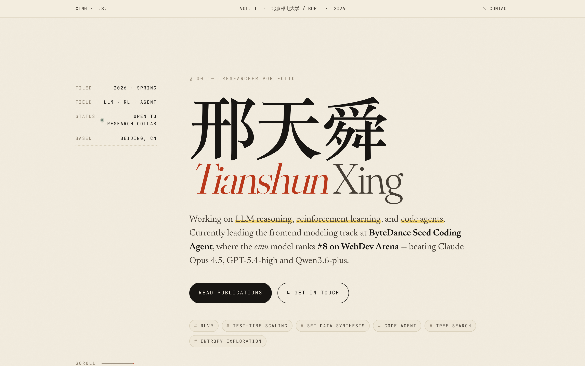

# 邢天舜 · Tianshun Xing — Personal Portfolio

A static personal-portfolio website built with vanilla HTML / CSS / JS, designed in an **editorial × research-notebook** aesthetic. No build step, no framework — open `index.html` and it just works.



> 🌐 **Live site**: <https://red-flowerr.github.io/>

---

## Preview locally

```bash
# 1. Just open the file
open index.html        # macOS
xdg-open index.html    # Linux
start index.html       # Windows

# 2. Or serve it (recommended; some browsers block fonts on file://)
python3 -m http.server 8080
# then visit http://localhost:8080
```

---

## Deploy to GitHub Pages

The local repository is **already initialized** with the remote pointing to
`https://github.com/red-Flowerr/red-Flowerr.github.io.git`.

You just need to (1) create the empty repo on GitHub and (2) push:

### Step 1 — Create the repo on GitHub

Go to <https://github.com/new> and fill in:

| Field         | Value                          |
|---------------|--------------------------------|
| Owner         | `red-Flowerr`                  |
| Repository    | `red-Flowerr.github.io`        |
| Visibility    | **Public** (required for free Pages) |
| Initialize    | ❌ Leave **unchecked** — no README, no .gitignore, no license |

Click **Create repository**.

### Step 2 — Push from this folder

```bash
cd /Users/bytedance/Downloads/xingtianshun-portfolio
git push -u origin main
```

If git asks for credentials, use a [Personal Access Token](https://github.com/settings/tokens?type=beta) as the password (PATs replaced raw passwords years ago).

### Step 3 — Enable GitHub Pages

On the new repo: **Settings → Pages → Build and deployment → Source: GitHub Actions**.

The workflow `.github/workflows/deploy.yml` will run automatically on every push and deploy the site. After ~1 minute, the site is live at:

**<https://red-flowerr.github.io/>**

---

## File structure

```
xingtianshun-portfolio/
├── index.html              # the page
├── styles.css              # all visual design
├── script.js               # scroll-reveal + copy-to-clipboard
├── README.md               # this file
└── .github/
    └── workflows/
        └── deploy.yml      # GitHub Actions deployment
```

---

## How to update content

Almost every change is a one-liner in `index.html`:

| What            | Where                                                                  |
|-----------------|------------------------------------------------------------------------|
| Name / tagline  | `<h1 class="display">…</h1>` and `<p class="lede">…</p>` in the hero    |
| Email / phone   | `#contact` section, `mailto:` and `tel:` links                          |
| Education       | `<section id="education">` — duplicate `<article class="entry">` blocks |
| Experience      | `<section id="experience">` — same `<article class="entry">` pattern    |
| Publications    | `<section id="publications">` — `<li class="paper">` items              |
| Accent color    | `--accent` CSS variable in `styles.css` (top of file)                   |
| Fonts           | The `<link>` tag in `<head>` and `--display / --body / --mono` vars     |

To swap the highlighted achievement on the hero, edit the `<mark>` and `<strong>` content inside `<p class="lede">`.

---

## Design notes

- **Type**: Fraunces (display, variable optical-size + WONK axis) + Newsreader (body) + JetBrains Mono (technical metadata).
- **Color**: Warm cream paper `#f3ede0` with a deep vermillion accent `#b9381b` and forest-green secondary.
- **Texture**: SVG fractal-noise grain overlay rendered with CSS `mix-blend-mode: multiply`.
- **Motion**: `IntersectionObserver`-driven scroll reveal with staggered delay; respects `prefers-reduced-motion`.
- **Bonus**: Click the "cite this profile" BibTeX block to copy it to your clipboard.

---

## License

MIT — feel free to fork and adapt for your own portfolio.
